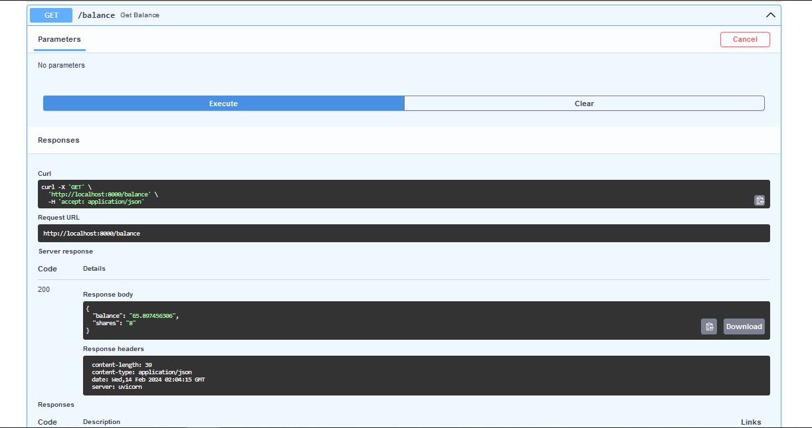

# Микросервис помощник для майнинг пула hyperpool

## Данный пул на момент релиза скрипта предлагает лучший хэшрейт для майнинга $GRAM
Но, у пула нет публичного апи, и узнать баланс можно только в оф боте.
Этот проект использует под капотом FastAPI + Telethon. 
Через Telethon создается сессия телеграм аккаунта. 
Через FastAPI реализуется управление аккаунтом. 
На данный момент вывел только информацию о балансе, личная нужда для софта мониторинга. 


## Install
```bash
git clone https://github.com/RitinaADM/gram_hyperpool
cd gram_hyperpool
pip install -r requirements.txt
```
Заполнить api_id и api_hash в файле .env (инструкция по получению https://tlgrm.ru/docs/api/obtaining_api_id)
## Run
```bash
python3 create_session.py
```
## Run
```bash
python3 server.py
```


### p.s. Оставлю свое приложение в конфиге, не знаю сколько оно проживет


13.02.24 данный пул запустил реферальную программу, [присоединяйтесь](https://t.me/hyperpool_bot?start=816021335)

